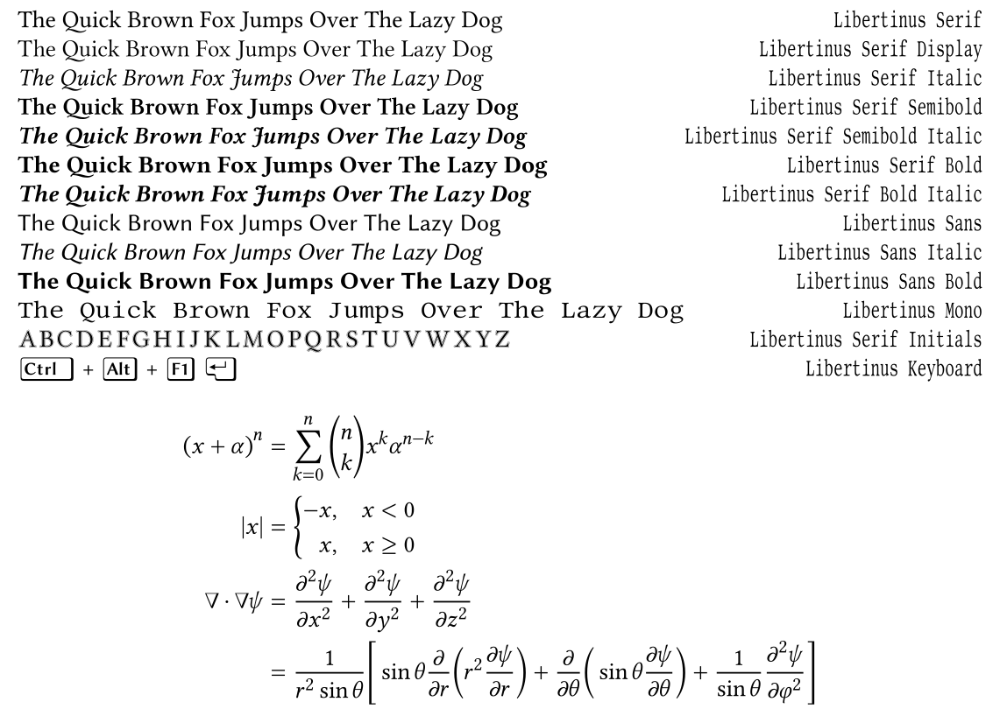

# Libertinus Fonts

[](https://github.com/alerque/libertinus/releases/latest)
[](https://github.com/alerque/libertinus/releases)
[![Fontship Build Status](https://img.shields.io/github/workflow/status/alerque/libertinus/Fontship?label=Fontship&logo=data:image/svg+xml;base64,PHN2ZyB3aWR0aD0iMTQyLjgiIGhlaWdodD0iMTA2LjgiIGNsaXAtcnVsZT0iZXZlbm9kZCIgZmlsbC1ydWxlPSJldmVub2RkIiBzdHJva2UtbGluZWNhcD0icm91bmQiIHN0cm9rZS1saW5lam9pbj0icm91bmQiIHhtbG5zPSJodHRwOi8vd3d3LnczLm9yZy8yMDAwL3N2ZyI+PHBhdGggZD0iTTEwLjEzIDBhMy4wOTQgMy4wOTQgMCAwMC0zLjA4MyAyLjgyNEwuMDE0IDgzLjIzNGEzLjA5MyAzLjA5MyAwIDAwMy4wODIgMy4zNjNoOS43MjZjLS4xMzYuNjc1LS4yNSAxLjM1Ni0uMzEgMi4wNTMtLjg2NCA5Ljg3MyA2LjcxMyAxOC4xOCAxNi42IDE4LjE4IDkuODg4IDAgMTguNDQtNy44NzUgMTkuMzEtMTcuNzUuMDc0LS44NDIuMDcxLTEuNjcuMDMtMi40ODhoNDUuNDNhMTguMDM5IDE4LjAzOSAwIDAwLS4zMTUgMi4wNTNjLS44NjUgOS44OCA2LjcxMyAxOC4xOSAxNi42MSAxOC4xOSA5Ljg5NSAwIDE4LjQ1LTcuODczIDE5LjMxLTE3Ljc1YTE3LjI4IDE3LjI4IDAgMDAtLjAyNC0zLjA3OGg2Ljk1N3YuMDAyYy41NTQuMDEyLjc5NC4wMSAxLjQ4NC4wMjcgMi4wMjcuMTA3IDMuMzMzLjE2IDMuOTIuMTYuMzIgMCAuNTM0LS4wNTMuNjQxLS4xNi4xNi0uMTA2LjI0LS4yNC4yNC0uNC4wNTMtLjIxMy4wOC0uNTU5LjA4LTEuMDM5IDAtLjUzMy0uMDUzLS44ODEtLjE2LTEuMDQxLS4xMDctLjE2LS4zNzQtLjI0LS44LS4yNGgtLjExbC44Ni05LjgxNGMxLjIxNy0xMy45Mi0zLjE1NS0yNy4zNS0xMi4xOS0zNy4yNmwtMy41NzUtMy45MTZhMi41MDYgMi41MDYgMCAwMC0xLjg1LS44MTdoLTIxLjQybDIuNDYzLTI4LjE1YTMuMDkzIDMuMDkzIDAgMDAtMy4wOC0zLjM2M3oiIGNsaXAtcnVsZT0ibm9uemVybyIgY29sb3I9IiMwMDAiIGZpbGw9IiNGRkYiIGZpbGwtcnVsZT0ibm9uemVybyIgc3Ryb2tlPSIjRkZGIiBzdHlsZT0iZm9udC1mZWF0dXJlLXNldHRpbmdzOm5vcm1hbDtmb250LXZhcmlhbnQtYWx0ZXJuYXRlczpub3JtYWw7Zm9udC12YXJpYW50LWNhcHM6bm9ybWFsO2ZvbnQtdmFyaWFudC1lYXN0LWFzaWFuOm5vcm1hbDtmb250LXZhcmlhbnQtbGlnYXR1cmVzOm5vcm1hbDtmb250LXZhcmlhbnQtbnVtZXJpYzpub3JtYWw7Zm9udC12YXJpYW50LXBvc2l0aW9uOm5vcm1hbDtmb250LXZhcmlhdGlvbi1zZXR0aW5nczpub3JtYWw7aW5saW5lLXNpemU6MDtpc29sYXRpb246YXV0bzttaXgtYmxlbmQtbW9kZTpub3JtYWw7c2hhcGUtbWFyZ2luOjA7c2hhcGUtcGFkZGluZzowO3RleHQtZGVjb3JhdGlvbi1jb2xvcjojMDAwO3RleHQtZGVjb3JhdGlvbi1saW5lOm5vbmU7dGV4dC1kZWNvcmF0aW9uLXN0eWxlOnNvbGlkO3RleHQtaW5kZW50OjA7dGV4dC1vcmllbnRhdGlvbjptaXhlZDt0ZXh0LXRyYW5zZm9ybTpub25lO3doaXRlLXNwYWNlOm5vcm1hbCIvPjxwYXRoIGQ9Ik0xMi45NiA2LjE4NmwtNi40OTQgNzQuMjNoODYuNThsNi40OTQtNzQuMjN6IiBmaWxsPSIjRkZGIiBzdHJva2U9IiNGRkYiLz48L3N2Zz4=)](https://github.com/alerque/libertinus/actions?workflow=Fontship)



The Libertinus Fonts project includes four main type families:

* The **Libertinus Serif** family:

    6 serif typefaces cover three weights (Regular, Semibold, Bold) in each of two styles (Regular, Italic); originally forked from *Linux Libertine*.

* The **Libertinus Sans** family:

    3 sans-serif typefaces cover Regular, a Bold weight, and an Italic style; originally forked from *Linux Biolinum*.

* The **Libertinus Mono** family:

    1 monospace typeface derived from the serif family; originally forked from *Linux Libertine Mono*.

* The **Libertinus Math** family:

    1 OpenType math typeface derived from the serif family with many extra glyphs and features for use in OpenType math-capable applications (such as LuaTeX, XeTeX, or MS Word 2007+).

Additionally included are 3 special-use families with a single typeface each:

* **Libertinus Serif Display**: A derivative of *Libertinus Serif Regular* optimized for display at large sizes.

* **Libertinus Serif Initials**: A derivative of *Libertinus Serif* with outlined variants of capital letter glyphs suitable for drop-caps or other decorations.

* **Libertinus Keyboard**: A derivative of *Libertinus Sans* with keyboard key outlines around each character suitable for use in technical documentation.


## Download

Downloads containing all the ready to use font files and documentation can be found on the [Releases][3] page of the project on GitHub.

To test drive changes on development font builds between tagged releases, the fonts resulting from each change can be downloaded and from the artifacts attached to each commit under the [Fontship workflow in the GitHub Actions tab](https://github.com/alerque/libertinus/actions?query=workflow%3AFontship+branch%3Amaster).

## Building

Font files for this project are generated using [Fontship][fontship].
Several methods are available for installation including a simple one-liner with no installation [using Docker][fontship-docker-setup].
Once equipped with Fontship, to build your own copy of this font project from scratch or to modify the sources and generate your own fonts, simply clone this repository, then run:

```console
$ fontship make
```

*Note*: This repository’s default branch was filtered after the v6.12 release to remove all of the binary OTF and other generated files from the commit history.
If you are cloning this repository just for the sources and don’t wish to download ~300MB worth of every font change ever built, please add `--single-branch` to your Git clone command.

## Contributing

Community contributions are welcome.
See the file [CONTRIBUTING.md](CONTRIBUTING.md) for instructions on how to build the fonts and contribute changes.

## History

The Libertinus font project began as a fork of the [Linux Libertine][1] and Linux Biolinum fonts.
Libertinus was forked from the [5.3.0 (2012-07-02) release][2] of Linux Libertine fonts.
The original impetus was to add an OpenType math companion to the Libertine font families.
Over time it grew into to a full-fledged fork addressing many of the bugs in the Libertine fonts.

Hat-tip to [Frédéric Wang][fred-wang] for coming up with the name “Libertinus”.

Thanks to [Khaled Hosny][khaledhosny] who was the primary contributor and maintainer from 2012–2020.
If you like this font please thank and even consider sponsoring him!

In 2020, Khaled passed the role of maintainer on to [Caleb Maclennan][alerque].

## License

All typefaces in the Libertinus Fonts project are released under the terms of the Open Font License, version 1.1.
See the license file [OFL.txt](OFL.txt) for details.

[1]: https://en.wikipedia.org/wiki/Linux_Libertine
[2]: https://sourceforge.net/projects/linuxlibertine/files/linuxlibertine/
[3]: https://github.com/alerque/libertinus/releases
[khaledhosny]: https://github.com/khaledhosny
[alerque]: https://github.com/alerque
[fred-wang]: https://github.com/fred-wang
[fontship]: https://github.com/theleagueof/fontship
[fontship-docker-setup]: https://github.com/theleagueof/fontship#docker-setup
