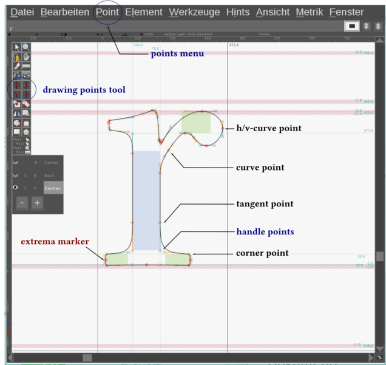
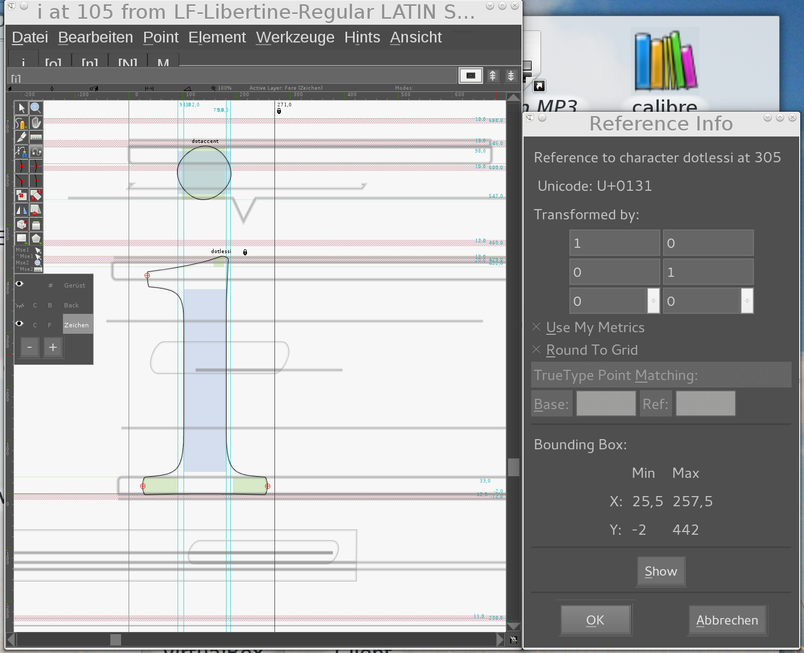

<!--

-->

<!-- TOC depthFrom:1 depthTo:6 withLinks:1 updateOnSave:1 orderedList:0 -->

- [Libertinus design guidelines](#libertinus-design-guidelines)
	- [Design principles](#design-principles)
		- [The perfection of the imperfect](#the-perfection-of-the-imperfect)
		- [The styles of Libertinus](#the-styles-of-libertinus)
		- [The serifs of Libertinus](#the-serifs-of-libertinus)
			- [The foot serifs](#the-foot-serifs)
			- [The middle head serifs (at x-height)](#the-middle-head-serifs-at-x-height)
			- [The ascender serifs (at ascender height)](#the-ascender-serifs-at-ascender-height)
			- [The half serifs](#the-half-serifs)
			- [The drop terminals](#the-drop-terminals)
		- [Two letters as primary design patterns ...](#two-letters-as-primary-design-patterns-)
			- [... `n` for letters with serifs](#-n-for-letters-with-serifs)
			- [... `o` for letters with round parts](#-o-for-letters-with-round-parts)
		- [Secondary design patterns](#secondary-design-patterns)
		- [Vertical metrics](#vertical-metrics)
		- [Spacing and tracking](#spacing-and-tracking)
		- [Overshoot and height metrics](#overshoot-and-height-metrics)
	- [FontForge font editor](#fontforge-font-editor)
		- [How the sources are organized](#how-the-sources-are-organized)
		- [The layers](#the-layers)
		- [Drawing splines and contours](#drawing-splines-and-contours)
		- [Accented glyphs](#accented-glyphs)
			- [Working with references](#working-with-references)
			- [Base marks and anchors](#base-marks-and-anchors)
	- [Authors](#authors)

<!-- /TOC -->

# Libertinus design guidelines

These are short guidelines for all volunteers who love libre fonts in general, the Libertinus font family in particular, and who are considering contributing to the latter.
All fonts contain a multitude of glyphs. Libertinus for example has several thousand glyphs, and while each is unique they also all fit together. The glyphs have to fit together — in their design, their optical weight, and their spacing. Some technical issues have to be addressed to achieve that.
Sounds complicated? Don't worry, these guidelines are to help get you started!

## Design principles

The shape of each letter is a social convention, usually a very old one. For example, the Latin alphabet was derived from Roman letters, those were based on Greek letters, which in turn have their roots in Phoenician scripts. In 765 AD, the [Carolingian minuscule](https://en.wikipedia.org/wiki/Carolingian_minuscule) was established as a standard for writing and thus gave our lower-case letters their present shape. Today with [Unicode]( http://www.unicode.org) we have a specification (i.e. a computing industry standard) defining the name, basic form, and encoding position of nearly every known glyph in the world.

A type designer thus works within a framework. They interpret the essence of a letter and make decisions about design characteristics such as:

1. **Serifs**: form and length of foot serif(s), head serif and ascender serif or even completely without => sans-serif;
2. **Font-weight**: as a result of stroke weight and spacing;
3. **Spacing / tracking**: the white area between letters and within them => size of counters;
4. **Contrast** between hairline and stem;
5. **Stress** or **axis**: the calligraphic angle;
6. **Proportion**: x-height and cap-height, length of ascender and descender.

### The perfection of the imperfect

Mathematically ideal forms are perfect but boring. That is one side of the coin. The other side is that typography has to take optical effects and peculiarities of human vision into account. The [overshoot](https://en.wikipedia.org/wiki/Overshoot_%28typography%29) of round characters, cupped serifs, tapered stems, kerning, etc. are examples of measures improving the overall impression and the legibility of type. These measures are summarized under the term [microtypography](https://en.wikipedia.org/wiki/Microtypography). A special property has gained importance with digitization: The distinguishability of similar glyphs.
A **counter-example** in this case is the famous [Futura](https://en.wikipedia.org/wiki/Futura_%28typeface%29) Paul Renner designed in 1927. Influenced by the Bauhaus ideals he reduced type to geometric elements. In his font `d`, `p`, `b`, and `q` are circles with stems that are just flipped or rotated copies of each other. The `a` is a `d` without ascender. The impression is a very reduced but somehow elegant font you can use as a display typeface in higher grades. But it definitely causes pain to read body text in Futura. You will of course find people denying that. Well, it is the sort of people who believe that the "frilled" serif antiqua is obsolete and sans-serif is the ne plus ultra.

### The styles of Libertinus

Currently, there are six different styles of Libertinus:

**Regular** and **Italic** have standard weight, also known as "book". They are designed for 11pt.
The **Bold** and **Bold italic** are heavier forms of the above mentioned. The **Display** is a special light and elegant variant for titles and headlines.
Each style of Libertinus contains a subset of small capitals. The **Small caps** style is an extended set of the regular style.

### The serifs of Libertinus

#### The foot serifs

The figure above shows a foot serif of Libertinus. Foot serifs are the most common serifs and give shape to the lower-case `f`, `h`, `i`, `k`, `l`, `m`, `n`,`r`, and many more upper-case letters. They occur in a diagonal form in the letters `k`, `v`, `w`, `x`, and `y`; not only at the baseline but also at the x-height. In `p` and `q` they form the descender.
In the figure, you can recognize that the serif's thickness in the regular style and the bold style is nearly identical, i.e. 33 EM : 34 EM (see [Vertical Metrics](#vertical-metrics)for an explanation of the unit "EM"), while the stem in the bold style is 1.6 times fatter.
**Did you notice?** The right half of the shown serif is a bit shorter than the opposite because it is the left serif of the `n`. This is an optical measure to avoid the foot serifs coming too close and narrow to the open counter. This is important for the legibility of `n`.
**Did you notice?** The outer left and right parts of the serif bow down a little, giving the whole a concave form. This measure is called "cupped serif".

#### The middle head serifs (at x-height)

This figure shows the head serif of `n`, `m`, `r`, and `p`. It is a characteristic of Libertinus that this serif bows to the left and opens the angle where stem and hairline join.
Have a look at `i` and `j`. Their head serifs are upright and do not bow to the left. There are just no angles to open.
**Did you notice?** The upper spline of the head serif is a bit concave. It is as "cupped" as the foot serif.

#### The ascender serifs (at ascender height)

The **ascender** (or **upper head serifs**) occurs in the letters `b`, `d`, `h`, `k`, and `l`. They look similar to the serifs of `i` and `j`, but they are in fact not identical.

#### The half serifs

Half-serifs occur in the lower-case letters `s` and `z`, and at capitals such as `C`, `G`, `F`, `L`, `S`, `T`, and `Z`. The half-serif of the `s` is nearly vertical while most others are diagonal. At the point where the outer contour passes over into the serif there is a right angle; a Libertinus characteristic. Compare round letters such as `C` and `G` with rectangular ones such as `F` and `T`.
In the bold style the diagonal stroke grows, but not as much as the verticals stems do. This is because the counters shrink, whereby the glyph already gains enough weight.
**Did you notice?** The half-serif's form is actually not cupped but even slightly convex.

#### The drop terminals

The drop occurs in the letters `a`, `c`, `f`, `g`, `j`, `r`, and `y`.
In the bold style, the drop terminals get much heavier while the hairline does not receive such a strong growth. In the figure you will also recognize that the x-height rises about 5 EM in the bold style.
**Did you notice?** The drops of Libertinus' letters are oblated at the end. You will also find that the `.` (period) and the bulbs of `,` and `"` are flattened. This is another characteristic of Libertinus.

### Two letters as primary design patterns ...
When developing a font, one starts with just a few letters (or "glyphs") and defines those as as design patterns. These are `n` and `o` in Libertinus.
In reverse, modifications on them causes conflicts with all derived letters, so you better do not touch them.

#### ... `n` for letters with serifs
The lower-case letter `n` defines:

* the **serifs**;
* the **stem width**. This is 79 EM for lower-case and, derived from that, 85 EM for upper-case;
* **Spacing**. The inner distance between the two stems. Thus, the white space of the counter affects tracking. It is regarded as default for optical spacing between letters;
* **font-weight**. An effect of stem width and tracking;
* **x-height** and **overshoot**: The body of lower-case letters is 429 EM tall. Round parts overshoot the x-height and the baseline about 10 EM. This typographic measure achieves that letters like `o`, `e`, `c`, but also `n`, `m`, `r`, etc. have the same optical height as `x`. In FontForge, the overshoot corridor is marked in rose color.

Derived letters: `m`, `r`, `h`, `i`, `j`, `l`, `u`, ...

#### ... `o` for letters with round parts
The lower-case letter `o` defines the following characteristics for all letters with round parts:

* **stress**: the calligraphic angle;
* **min./max. width** of round strokes, i.e. 35 EM for thinnest and 86 EM for boldest part of stroke;
* **Spacing**. The white space of the counter affects tracking. This is because the white space  between glyphs (the sum of the optical bearings) shall be equal to the counter. To find the correct spacing for the glyphs is a hard piece of work;
* **Bearings** as indication for spacing of round characters.

The right part of the figure shows a bold `o` with the pointed contour of the regular `o` on top of it. You can see that the vertical strokes grow in width while the hairline nearly stays the same. The glyph emboldens especially at the outer part and becomes wider. The strokes also gain width on the inner side of the character whereby the counter shrinks. Both, the increased stroke thickness and the shrink of the counters, result in a heavier font weight.

Derived letters: `e`, `c`, and round parts of `b`, `d`, `p`, `q`, `g`, .... **Please note:** *Derived* does not simply mean "copy and paste". When it comes to the round parts of glyphs, you will always have to modify and improve form, weight, and bearings.

### Secondary design patterns

Besides the letters `n` and `o`, all basic alphabetic characters form the sets of secondary design patterns. The following table lists the Unicode ranges of secondary design patterns.

| Alphabet     | Glyphs     | Unicode Range     | Chart    |
| :------------- | :------------- | :------------- | :------------- |
| Basic Latin (ASCII)      | `0--9` `A--Z` `a--z` | 0000--007F       | [PDF](figures/LF-Libertinus_BasicLatin.pdf)   |
| Basic Greek       | `Α--Ω` `α--ω`    | 0370--03FF   | [PDF](figures/LF-Libertinus_BasicGreek.pdf)    |
| Basic Cyrillic       | `А--Я` `а--я`       | 0400--04FF | *to do*   |

### Vertical metrics

The figure shows the vertical metric of Libertinus Regular. The horizontal borderlines are called "heights". The **x-height** for example is the upper horizontal border of lower-case like `a`, `c`, `e`, ..., `x`. Libertinus' upper-case glyphs are a bit shorter (=> **caps-height**) than the ascenders of the lower-case glyphs (=> **ascender-height**). This is also true for numbers which have their own **numbers-height** and for small caps with their **caps-height**.
By definition, the height of the EM square is divided into 1000 units we call "EM units" or just "EM". Simply speaking, we are working in an Cartesian coordinate system.
**Have you noticed** the rose colored margins? They are the overshoot-margins. As mentioned above, round glyph-parts have to overshoot the line-height to form the optical illusion of evenness.

### Spacing and tracking

Well, you have drawn a wonderful glyph and now you think that the work is done? Wrong! The spacing and finding the right tracking of a glyph is one of the major tasks. You have to check dozens of constellations of glyph pairs and have to make lots of compromises. The figure shows the counter space in blue and the inter-glyph spacing in red. The counters play an important role in tracking. The spacing and counters should be equally balanced.
Remember the figure indicating the bold `o`? Thinner counters lead to thinner letter spacing, and thus to an increased density of the face and higher weight.
Libertinus' glyphs are already fairly well-spaced. If you want to set the spacing of a new glyph or improve the existing one, chose one of the reference characters that resembles yours and make a decision based on that.

### Overshoot and height metrics

*Please complement description.*

## FontForge font editor

Libertinus is being developed with the font editor FontForge. Binary packages are available for many Linux distributions (Ubuntu, Fedora, OpenSUSE ...), macOS, and Windows. See [FontForge's project page](http://fontforge.github.io) for more information.
There is also a fairly good manual: [Design fonts with FontForge](http://designwithfontforge.com/en-US/index.html).

### The layers

In the glyph view you will find a little tool-box called "layers" amongst others. The contours of Libertinus are stored in the "glyph layer". You can use the "background layer" to store contours from another glyph for comparing certain characteristics like form, height, counter width, and such. Finally, the "guide layer" contains metrical lines such as x-height, caps-height, etc. and it is actually unique for all glyphs. So, please leave that one untouched.

### Drawing splines and contours

Vector based fonts such as TTF and OTF use [Bézier curves](https://en.wikipedia.org/wiki/B%C3%A9zier_curve). You will know them from vector graphics editors such as Inkscape or Illustrator. FontForge knows four different point types:

1. the curve point (left and right handle stick together);
2. the h/v curve point (90° horizontal or vertical handles);
3. the corner point (left and right handle are independent);
4. the tangent point (the handle follows the direction of the afferent spline).

You can easily change the point type via the point menu. A right click on a point will open a context menu, allowing you to control the type and exact position of the point and its handle points.

Contours always have to be closed. Only closed contours will fill. Outer contours have to be tagged clockwise. Inner contours (forming counters) need to be tagged counter-clockwise.

### Accented glyphs

#### Working with references

The latin codepages contain a lot of accented characters. These are generally nothing else but different combination of basic glyphs and accents. For example, the `é` is combined of `e` + `´`. You do not need to work with copied contours in these cases. You can and should make use of a reference that points to the original glyph.

**Example:** The letter `i` is in fact also an accented character made up of the glyphs `ı` (named *dottlessi*) and `˙` (named *dotaccent*). To ensure that improvements in the metrics of the referenced glyph are handed down to the derivated glyph, the checkbox "Use my metrics" has to be enabled.
Nearly all imaginable kind of accents have been encoded by now. You can find them in these two Unicode charts:
* [Unicode-Chart Combining Diacritical Marks *U+0300--U+036F*](http://unicode.org/charts/PDF/U0300.pdf)
* [Supplement *U+1DC0--U+1DFF*](http://unicode.org/charts/PDF/U1DC0.pdf)

#### Base marks and anchors

*Please complement description.*

## Authors

- Gillian Tiefenlicht [GillianTL](https://github.com/GillianTL)
